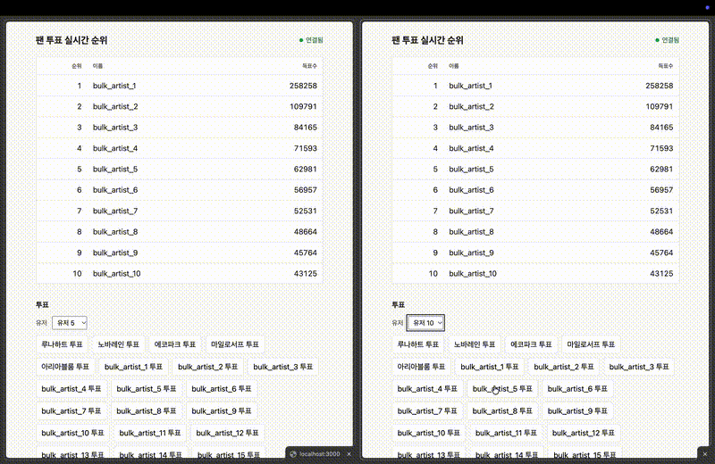
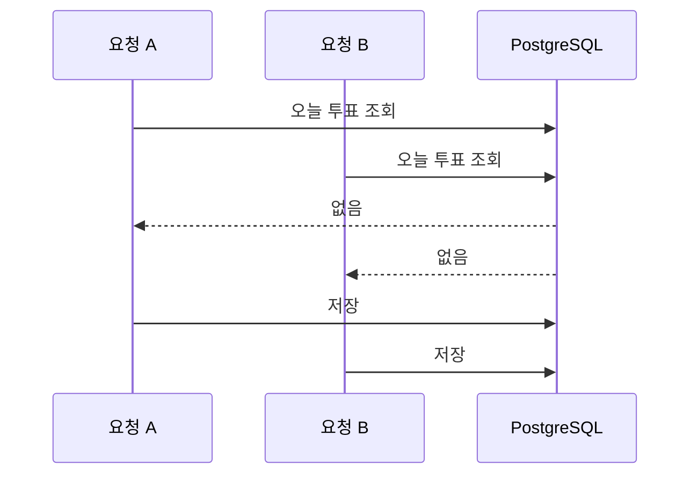

# fan-vote


팬 투표 서비스의 미니 버전이다. NestJS와 PostgreSQL로 투표 API를 만들고, 중복 방지, 랭킹, 실시간 현황을 단계적으로 붙이는 포트폴리오 프로젝트다. 로그인은 구현하지 않으며, 투표 요청의 `userId`는 데모용이다.



## 실행 방법

```bash
git clone https://github.com/yuj0727-sys/fan-vote.git
cd fan-vote
npm install
cp .env.example .env
docker compose up -d
npm run seed
npm run start:dev
```

서버는 `http://localhost:3000`에서 실행된다. 브라우저로 같은 주소를 열면 실시간 순위 데모 페이지가 나온다. `npm run seed`는 아티스트 5명과 유저 10명(`user1`~`user10`)을 넣으며, 이미 있으면 건너뛴다.

## API

### GET /artists

아티스트 목록을 반환한다. 응답 필드는 `id`, `name`이다.

```bash
curl http://localhost:3000/artists
```

### POST /votes

투표를 저장한다. 요청 body는 `{ "userId": number, "artistId": number }`이고, 둘 다 양의 정수여야 한다. `votedDate`는 Asia/Seoul 기준 오늘 날짜로 저장된다. 성공하면 201과 함께 `id`, `userId`, `artistId`, `votedDate`를 반환한다. 없는 유저나 아티스트는 404다.

```bash
curl -X POST http://localhost:3000/votes \
  -H 'Content-Type: application/json' \
  -d '{"userId":1,"artistId":1}'
```

### WebSocket `/rankings`

socket.io 네임스페이스는 `/rankings`다. 클라이언트가 접속하면 그 소켓에만 `ranking:snapshot`으로 현재 누적 순위 상위 10개를 보낸다. 투표가 저장된 뒤에는 접속 중인 클라이언트 모두에게 `ranking:updated`로 같은 모양의 상위 10개를 보낸다.

페이로드는 순위 객체 배열이다. `rank`, `artistId`, `name`, `voteCount`를 가진다.

```json
[
  {
    "rank": 1,
    "artistId": 1,
    "name": "루나하트",
    "voteCount": 12
  }
]
```

## 진행 현황

- [x] 프로젝트 세팅 / 투표 API 기본
- [x] 중복·동시성 처리
- [x] 랭킹 조회 및 인덱스 최적화
- [x] WebSocket 실시간 현황

## 알려진 한계

- 서버가 여러 대면 소켓 방송이 인스턴스 간에 전달되지 않는다. Redis adapter는 넣지 않았다.
- 순위 변경분(diff)만 보내지 않고, 상위 10개 전체를 보낸다.
- SSE는 쓰지 않는다.
- 소켓 인증이 없다.
- 소켓 레이트 리밋이 없다.

## 설계 메모

### 중복·동시성 처리

같은 유저가 같은 아티스트에게 하루에 한 표.

#### 문제

저장 전에 "오늘 이미 투표했나?"를 조회하면, 동시에 들어온 두 요청이 둘 다 없다고 본다. 표가 두 장 들어간다.




같은 투표를 50번 동시에 보내면 전부 저장됐다.


|         | 201 | 409 |
| ------- | --- | --- |
| 조회 후 저장 | 50  | 0   |
| 유니크 제약  | 1   | 49  |


#### 시도한 방법

- 애플리케이션 락. 서버 한 대에서만 막힌다. 서버가 여러 대면 요청이 갈라져 락을 통과한다.
- 트랜잭션 격리 수준 상향. 잠금 범위가 넓어져 느려진다.
- Redis 분산 락. 막으려면 인프라가 하나 더 필요하다.

#### 선택 이유

`(userId, artistId, votedDate)` 복합 유니크 제약을 걸었다. 같은 조합의 저장은 데이터베이스가 한 건만 통과시키고, 나머지는 `23505`로 거절한다. API는 그 에러를 409로 돌려준다.

`votedDate`는 서울 날짜다. UTC로 자르면 한국 시간 0시~9시는 날짜가 하루 밀려, 제약의 "하루"가 사용자가 보는 날과 달라진다.


| UTC              | 서울 날짜      |
| ---------------- | ---------- |
| 2026-01-01 14:59 | 2026-01-01 |
| 2026-01-01 16:00 | 2026-01-02 |


#### 트레이드오프

"하루 1회, 아티스트당"이 제약에 박혀 있다. 규칙을 바꾸면 제약과 마이그레이션도 같이 바꾼다.

### 랭킹 조회 최적화

일별 랭킹은 하루치 표를 아티스트별로 센다. 누적 랭킹은 기간 없이 전부 센다. 표가 쌓이면 조회할 때마다 `vote`를 집계하는 비용이 커진다.

#### 문제

개선 전에는 `vote`를 `artistId`로 GROUP BY한 서브쿼리를 `artist`에 LEFT JOIN했다. 득표가 0인 아티스트도 포함한다. 일별 랭킹만 `votedDate`로 거른다.

#### 측정 환경

로컬 Docker의 PostgreSQL에서 쟀다. 운영 환경의 장비, 데이터 양, 동시 접속이 다르면 수치는 달라질 수 있다.

`docs/perf/ranking-benchmark.md`에 적힌 환경이다.


| 항목         | 값      |
| ---------- | ------ |
| PostgreSQL | 16     |
| 실행 환경      | Docker |
| 머신         |        |
| 데이터 규모     |        |


#### 개선 전

인덱스 없이 집계했다. 실행 계획과 중앙값은 측정 문서의 값이다.


| 시나리오      | 인덱스 | 실행 계획(핵심 노드) | 중앙값(ms) |
| --------- | --- | ------------ | ------- |
| 일별 랭킹     | 없음  |              |         |
| 누적 랭킹(집계) | 없음  |              |         |


#### 시도 1. 인덱스

`vote`에 `idx_votes_date_artist` (`votedDate`, `artistId`)를 걸었다. `WHERE`에 쓰는 날짜를 앞에 두고, `GROUP BY`에 쓰는 아티스트를 뒤에 두었다. 일별 랭킹은 그 날짜의 행만 인덱스에서 찾고, 아티스트별 집계까지 인덱스만으로 할 수 있다.

#### 결과와 한계


| 시나리오      | 인덱스                   | 실행 계획(핵심 노드)        | 중앙값(ms)   |
| --------- | --------------------- | ------------------- | --------- |
| 일별 랭킹     | 없음                    | 투표 테이블 병렬 전체 스캔     | 11.950 ms |
| 일별 랭킹     | idx_votes_date_artist | 복합 인덱스 기반 인덱스 전용 스캔 | 0.324 ms  |
| 누적 랭킹(집계) | 없음                    | 투표 테이블 병렬 전체 스캔     | 46.620 ms |
| 누적 랭킹(집계) | idx_votes_date_artist | 투표 테이블 병렬 전체 스캔     | 44.761 ms |


일별 랭킹은 `votedDate`로 거른다. 인덱스 첫 컬럼과 조건이 같다.

누적 랭킹은 날짜 조건이 없다. 인덱스가 `votedDate`로 시작해도 더할 행을 골라 내지 못한다. 전체 합을 구하려면 `vote`의 모든 행을 읽어야 해서, 이 인덱스로는 읽을 양이 거의 줄지 않는다.

#### 시도 2. 카운터 테이블

`artist_vote_counts`에 아티스트별 `totalCount`를 둔다. 투표 INSERT와 같은 트랜잭션에서 `totalCount`를 1 올린다. 유니크 제약에 걸리면 트랜잭션이 롤백되어 카운터는 오르지 않는다. 누적 랭킹은 `artist`를 이 테이블에 LEFT JOIN한다. 행이 없는 아티스트는 0표다.


| 시나리오           | 인덱스 | 실행 계획(핵심 노드)  | 중앙값(ms)  |
| -------------- | --- | ------------- | -------- |
| 누적 랭킹(카운터 테이블) |     | 투표 카운터 테이블 조회 | 0.044 ms |


이미 쌓인 표는 `npm run backfill:counts`로 `vote`를 `artistId`로 묶어 카운터를 덮어쓴다.

#### 트레이드오프

조회는 투표 전체를 세지 않고 아티스트별 합계만 읽는다. 그 대신 투표가 성공할 때마다 UPDATE가 한 번 더 있다. 인기 아티스트는 카운터 행이 하나라 쓰기가 그 행에 몰린다. `vote`만 직접 고치면 합계와 어긋날 수 있어, 백필로 다시 맞춰야 한다.

#### 다른 대안

아래는 검토만 하고 구현하지 않았다.

- Redis sorted set. 점수 증가와 순위 조회가 빠르다. 저장소가 늘고, PostgreSQL의 표와 점수가 어긋날 수 있다.
- Materialized view와 주기적 갱신. 조회 SQL은 두고 결과만 미리 만들 수 있다. 갱신 전에는 순위가 오래되고, 갱신할 때는 전체 집계를 다시 한다.
- 배치 집계. 투표 경로에는 비용이 없다. 배치가 돌기 전에는 순위가 늦다.

### 실시간 순위 갱신

#### 문제

투표가 끝나면 다른 사용자 화면의 순위도 바뀌어야 한다. 투표가 몰리면 그때마다 알림을 보내 조회와 전송이 함께 늘어난다.

#### 선택

1. `vote.created`는 투표 저장 트랜잭션이 커밋된 뒤에만 발행한다. 롤백되거나 409로 거절되면 이벤트가 나가지 않아, 저장되지 않은 투표를 순위에 알리지 않는다. `Votes`는 게이트웨이를 직접 부르지 않고, `Realtime`은 이 이벤트만 구독한다.
2. 간격 안에 들어온 투표는 순위 조회와 전송을 한 번으로 모은다. 조회 쿼리 수와 전송량이 투표 수에 비례하지 않는다. 기본 간격은 1초이고, `RANKING_BROADCAST_INTERVAL_MS`로 바꾼다.
3. 방송에 실리는 순위는 누적 랭킹용 카운터 테이블 조회를 그대로 쓴다. 실시간용 쿼리를 따로 두지 않았다.

#### 트레이드오프

반영은 최대 약 한 간격만큼 늦다. 순위 전체를 통째로 보내므로, 보내는 범위는 상위 10개로 제한했다.

#### 구현하지 않은 대안

- 서버가 여러 대면 소켓 인스턴스 사이로 방송이 전달되지 않는다. 그때는 Redis adapter가 필요하다.
- 변경된 순위만 보내는 방식.
- SSE. 서버에서 클라이언트로만 보내면 연결이 더 단순하다.
- 소켓 인증과 레이트 리밋.

