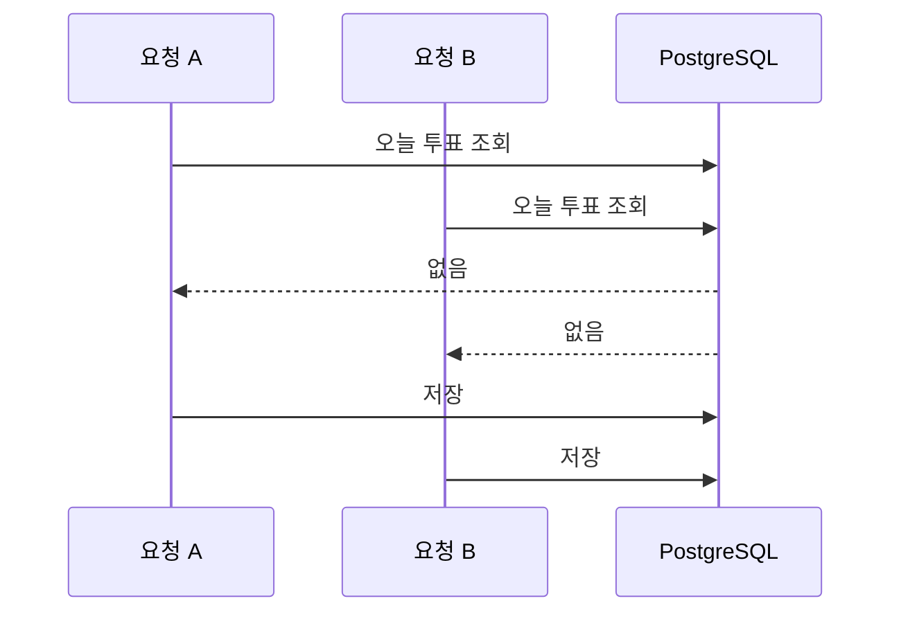

# fan-vote

팬 투표 서비스의 미니 버전이다. NestJS와 PostgreSQL로 투표 API를 만들고, 중복 방지, 랭킹, 실시간 현황을 단계적으로 붙이는 포트폴리오 프로젝트다. 로그인은 구현하지 않으며, 투표 요청의 `userId`는 데모용이다.

## 기술 스택

- TypeScript, NestJS
- TypeORM, PostgreSQL 16
- Docker Compose
- class-validator

## 실행 방법

```bash
git clone https://github.com/yuj0727-sys/fan-vote.git
cd fan-vote
npm install
cp .env.example .env
docker compose up -d
npm run seed
npm run start:dev
```

서버는 `http://localhost:3000`에서 실행된다. `npm run seed`는 아티스트 5명과 유저 10명(`user1`~`user10`)을 넣으며, 이미 있으면 건너뛴다.

## API

### GET /artists

아티스트 목록을 반환한다. 응답 필드는 `id`, `name`이다.

```bash
curl http://localhost:3000/artists
```

### POST /votes

투표를 저장한다. 요청 body는 `{ "userId": number, "artistId": number }`이고, 둘 다 양의 정수여야 한다. `votedDate`는 Asia/Seoul 기준 오늘 날짜로 저장된다. 성공하면 201과 함께 `id`, `userId`, `artistId`, `votedDate`를 반환한다. 없는 유저나 아티스트는 404다.

```bash
curl -X POST http://localhost:3000/votes \
  -H 'Content-Type: application/json' \
  -d '{"userId":1,"artistId":1}'
```

## 진행 현황

- [x] 프로젝트 세팅 / 투표 API 기본
- [x] 중복·동시성 처리
- [ ] 랭킹 조회 및 인덱스 최적화
- [ ] WebSocket 실시간 현황

## 설계 메모

### 중복·동시성 처리

같은 유저가 같은 아티스트에게 하루에 한 표.

#### 문제

저장 전에 "오늘 이미 투표했나?"를 조회하면, 동시에 들어온 두 요청이 둘 다 없다고 본다. 표가 두 장 들어간다.



같은 투표를 50번 동시에 보내면 전부 저장됐다.

| | 201 | 409 |
| --- | ---: | ---: |
| 조회 후 저장 | 50 | 0 |
| 유니크 제약 | 1 | 49 |

#### 시도한 방법

- 애플리케이션 락. 서버 한 대에서만 막힌다. 서버가 여러 대면 요청이 갈라져 락을 통과한다.
- 트랜잭션 격리 수준 상향. 잠금 범위가 넓어져 느려진다.
- Redis 분산 락. 막으려면 인프라가 하나 더 필요하다.

#### 선택 이유

`(userId, artistId, votedDate)` 복합 유니크 제약을 걸었다. 같은 조합의 저장은 데이터베이스가 한 건만 통과시키고, 나머지는 `23505`로 거절한다. API는 그 에러를 409로 돌려준다.

`votedDate`는 서울 날짜다. UTC로 자르면 한국 시간 0시~9시는 날짜가 하루 밀려, 제약의 "하루"가 사용자가 보는 날과 달라진다.

| UTC | 서울 날짜 |
| --- | --- |
| 2026-01-01 14:59 | 2026-01-01 |
| 2026-01-01 16:00 | 2026-01-02 |

#### 트레이드오프

"하루 1회, 아티스트당"이 제약에 박혀 있다. 규칙을 바꾸면 제약과 마이그레이션도 같이 바꾼다.

### 랭킹 속도

인덱스는 책 뒤의 찾아보기와 같다. 날짜와 아티스트를 같이 적어두면, 그날 표만 바로 찾을 수 있다.

같은 데이터로 넣기 전과 후를 비교했다. 숫자는 여러 번 잰 가운데 시간이다. 1ms는 1,000분의 1초다.

| 구분 | 걸린 시간 | 읽은 범위 |
| --- | ---: | --- |
| 하루 순위 (넣기 전) | 11.950 ms | 투표 기록 전체 |
| 하루 순위 (넣은 뒤) | 0.324 ms | 그날 기록만 |
| 전체 순위 (넣기 전) | 46.620 ms | 투표 기록 전체 |
| 전체 순위 (지금) | 44.761 ms | 투표 기록 전체 |

하루 순위는 약 37배 빨라졌다. 그날 표만 세기 때문이다. 전체 순위는 모든 날의 표를 더하므로 거의 그대로이고, 기록을 처음부터 끝까지 읽는다.
